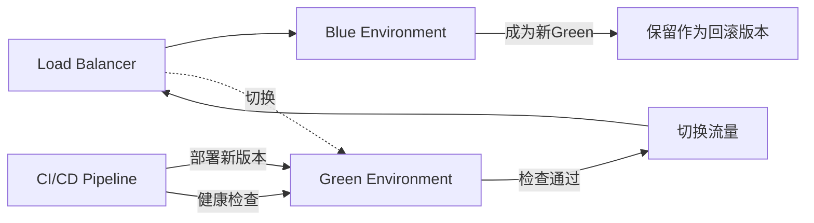
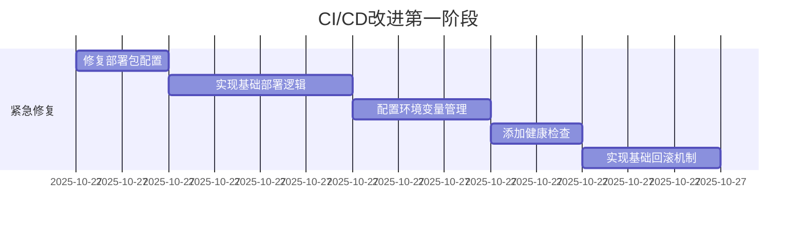
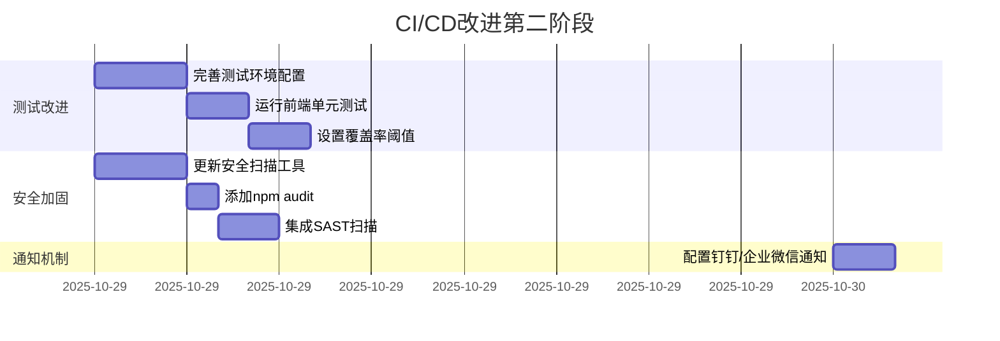
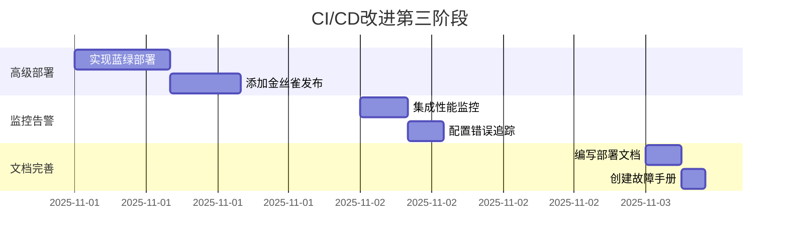

    
    - name: Run unit tests
      working-directory: ./web
      run: npm run test:unit -- --coverage
    
    - name: Check coverage threshold
      working-directory: ./web
      run: |
        # 使用jest或vitest的coverage配置
        npm run test:unit -- --coverage --coverageThreshold='{"global":{"statements":80,"branches":80,"functions":80,"lines":80}}'
    
    - name: Upload frontend coverage
      uses: codecov/codecov-action@v3
      with:
        file: ./web/coverage/lcov.info
        flags: frontend
        name: frontend-coverage
```

---

### 建议4: 集成通知机制

**优先级**: 🟡 P1  
**工作量**: 1-2小时  

**钉钉通知示例**:
```yaml
notify:
  runs-on: ubuntu-latest
  needs: [backend-tests, frontend-tests, build-and-deploy]
  if: always()
  steps:
    - name: Send DingTalk notification
      uses: zcong/dingding-action@master
      with:
        dingToken: ${{ secrets.DINGTALK_ACCESS_TOKEN }}
        body: |
          {
            "msgtype": "markdown",
            "markdown": {
              "title": "CI/CD 构建通知",
              "text": "### ${{ github.workflow }} \n\n **状态**: ${{ job.status }} \n\n **分支**: ${{ github.ref }} \n\n **提交**: ${{ github.sha }} \n\n **作者**: ${{ github.actor }} \n\n **查看详情**: [点击这里](${{ github.server_url }}/${{ github.repository }}/actions/runs/${{ github.run_id }})"
            }
          }
```

**企业微信通知示例**:
```yaml
    - name: Send WeChat Work notification
      if: always()
      run: |
        STATUS="${{ job.status }}"
        COLOR="info"
        [[ "$STATUS" == "success" ]] && COLOR="info"
        [[ "$STATUS" == "failure" ]] && COLOR="warning"
        
        curl -X POST "${{ secrets.WECHAT_WEBHOOK }}" \
          -H "Content-Type: application/json" \
          -d '{
            "msgtype": "markdown",
            "markdown": {
              "content": "**CI/CD构建通知**\n状态: <font color=\"'$COLOR'\">'$STATUS'</font>\n分支: ${{ github.ref }}\n作者: ${{ github.actor }}\n[查看详情](${{ github.server_url }}/${{ github.repository }}/actions/runs/${{ github.run_id }})"
            }
          }'
```

---

### 建议5: 增强安全扫描

**优先级**: 🟡 P1  
**工作量**: 2-3小时  

```yaml
security-scan:
  runs-on: ubuntu-latest
  steps:
    - uses: actions/checkout@v4
    
    - name: Setup PHP
      uses: shivammathur/setup-php@v2
      with:
        php-version: ${{ env.PHP_VERSION }}
    
    # 后端安全扫描
    - name: Install dependencies
      run: composer install --prefer-dist --no-progress
    
    - name: Run Composer Audit
      run: composer audit --format=json | tee composer-audit.json
    
    - name: Run Psalm SAST
      run: |
        composer require --dev vimeo/psalm
        vendor/bin/psalm --output-format=github --no-cache
    
    - name: Run PHPStan Security Analysis
      run: |
        composer require --dev phpstan/phpstan
        vendor/bin/phpstan analyse app/ --level=max --no-progress
    
    # 前端安全扫描
    - name: Setup Node.js
      uses: actions/setup-node@v4
      with:
        node-version: ${{ env.NODE_VERSION }}
    
    - name: Install frontend dependencies
      working-directory: ./web
      run: npm ci
    
    - name: Run npm audit
      working-directory: ./web
      run: |
        npm audit --audit-level=moderate --json > npm-audit.json || true
        npm audit --audit-level=moderate
    
    # 依赖扫描
    - name: Dependency Review
      uses: actions/dependency-review-action@v3
      if: github.event_name == 'pull_request'
    
    # 秘密扫描
    - name: Gitleaks scan
      uses: gitleaks/gitleaks-action@v2
      env:
        GITHUB_TOKEN: ${{ secrets.GITHUB_TOKEN }}
    
    # 上传扫描结果
    - name: Upload security scan results
      uses: actions/upload-artifact@v3
      if: always()
      with:
        name: security-reports
        path: |
          composer-audit.json
          npm-audit.json
```

---

### 建议6: 实现蓝绿部署

**优先级**: 🟢 P2  
**工作量**: 6-8小时  

**架构图**:


**实现步骤**:
```yaml
deploy-blue-green:
  runs-on: ubuntu-latest
  steps:
    - name: Determine target environment
      id: target
      run: |
        # 检查当前活动环境
        ACTIVE=$(curl -s http://api.example.com/api/health/info | jq -r '.environment')
        if [ "$ACTIVE" == "blue" ]; then
          echo "target=green" >> $GITHUB_OUTPUT
          echo "inactive=blue" >> $GITHUB_OUTPUT
        else
          echo "target=blue" >> $GITHUB_OUTPUT
          echo "inactive=green" >> $GITHUB_OUTPUT
        fi
    
    - name: Deploy to ${{ steps.target.outputs.target }}
      uses: appleboy/ssh-action@master
      with:
        host: ${{ secrets.PRODUCTION_HOST }}
        username: ${{ secrets.PRODUCTION_USER }}
        key: ${{ secrets.SSH_PRIVATE_KEY }}
        script: |
          cd /var/www/${{ steps.target.outputs.target }}
          # 部署新版本
          tar -xzf /tmp/deployment/*.tar.gz
          composer install --no-dev
          php think migrate:run --force
    
    - name: Health check new environment
      run: |
        for i in {1..10}; do
          if curl -f http://${{ steps.target.outputs.target }}.example.com/api/health/check; then
            echo "Health check passed"
            exit 0
          fi
          sleep 10
        done
        exit 1
    
    - name: Switch traffic
      if: success()
      run: |
        # 更新负载均衡器配置
        curl -X POST http://loadbalancer/api/switch \
          -d '{"active": "${{ steps.target.outputs.target }}"}'
    
    - name: Verify switch
      run: |
        sleep 10
        ACTIVE=$(curl -s http://api.example.com/api/health/info | jq -r '.environment')
        if [ "$ACTIVE" != "${{ steps.target.outputs.target }}" ]; then
          echo "Switch verification failed"
          exit 1
        fi
```

---

## 📈 改进路线图

### 第一阶段: 紧急修复 (1-2天)



**目标**: 
- ✅ 修复阻碍部署的关键问题
- ✅ 实现基本的自动化部署流程
- ✅ 确保部署安全性

### 第二阶段: 质量提升 (3-5天)



**目标**:
- ✅ 提高代码质量保证
- ✅ 加强安全防护
- ✅ 改善团队协作

### 第三阶段: 高级特性 (5-7天)



**目标**:
- ✅ 实现零停机部署
- ✅ 完善监控体系
- ✅ 提升运维效率

---

## 🎯 实施计划

### 任务分解

| 任务ID | 任务名称 | 优先级 | 预计工时 | 依赖 | 负责人 |
|--------|---------|--------|---------|------|--------|
| T1 | 修复部署包配置 | P0 | 2h | - | DevOps |
| T2 | 实现SSH部署脚本 | P0 | 4h | T1 | DevOps |
| T3 | 配置GitHub Secrets | P0 | 2h | - | DevOps |
| T4 | 创建环境配置文件 | P0 | 1h | T3 | DevOps |
| T5 | 添加健康检查 | P0 | 2h | T2 | Backend |
| T6 | 实现自动回滚 | P0 | 3h | T5 | DevOps |
| T7 | 添加Redis服务 | P1 | 1h | - | Backend |
| T8 | 完善测试数据初始化 | P1 | 2h | T7 | Backend |
| T9 | 运行前端单元测试 | P1 | 2h | - | Frontend |
| T10 | 设置覆盖率阈值 | P1 | 2h | T8, T9 | QA |
| T11 | 更新安全扫描工具 | P1 | 3h | - | Security |
| T12 | 集成npm audit | P1 | 1h | T11 | Frontend |
| T13 | 添加SAST扫描 | P1 | 2h | T11 | Security |
| T14 | 配置钉钉通知 | P1 | 2h | - | DevOps |
| T15 | 实现蓝绿部署 | P2 | 8h | T2, T5 | DevOps |

### 资源需求

**人员**:
- DevOps工程师: 1人, 全职
- 后端工程师: 1人, 部分时间
- 前端工程师: 1人, 部分时间
- QA工程师: 1人, 部分时间

**时间**:
- 第一阶段(P0): 2个工作日
- 第二阶段(P1): 3个工作日
- 第三阶段(P2): 5个工作日
- **总计**: 约10个工作日

---

## 📝 配置清单

### GitHub Secrets 配置清单

**必须立即配置**(P0):
```bash
# SSH访问
SSH_PRIVATE_KEY

# 应用密钥
APP_KEY
JWT_SECRET

# 生产环境
PRODUCTION_HOST
PRODUCTION_USER
PRODUCTION_DB_HOST
PRODUCTION_DB_NAME
PRODUCTION_DB_USER
PRODUCTION_DB_PASSWORD
PRODUCTION_REDIS_HOST
```

**建议配置**(P1):
```bash
# 测试环境
STAGING_HOST
STAGING_USER
STAGING_DB_HOST
STAGING_DB_NAME
STAGING_DB_USER
STAGING_DB_PASSWORD

# 通知
DINGTALK_ACCESS_TOKEN
WECHAT_WEBHOOK

# 监控
SENTRY_DSN
CODECOV_TOKEN
```

### 服务器环境清单

**必需软件**:
- PHP 8.1+
- MySQL 8.0+
- Redis 6+
- Nginx/Apache
- Composer
- Git

**目录结构**:
```bash
/var/www/
├── production/     # 生产环境
├── staging/        # 测试环境
├── blue/          # 蓝环境(可选)
└── green/         # 绿环境(可选)

/backup/           # 备份目录
├── code/          # 代码备份
└── database/      # 数据库备份
```

---

## 🔍 验收标准

### 功能验收

- [ ] **部署自动化**: 推送到main分支后自动部署到生产环境
- [ ] **测试覆盖**: 所有测试通过且覆盖率≥80%
- [ ] **健康检查**: 部署后自动执行健康检查
- [ ] **自动回滚**: 健康检查失败时自动回滚
- [ ] **通知机制**: 构建结果及时通知到团队
- [ ] **安全扫描**: 自动扫描依赖漏洞和代码问题
- [ ] **环境隔离**: 测试环境和生产环境完全隔离

### 性能指标

- **构建时间**: ≤ 10分钟
- **部署时间**: ≤ 5分钟
- **健康检查时间**: ≤ 2分钟
- **回滚时间**: ≤ 3分钟

### 可靠性指标

- **成功率**: ≥ 95%
- **误报率**: ≤ 5%
- **平均故障恢复时间(MTTR)**: ≤ 10分钟

---

## 📚 相关文档

### 需要创建的文档

1. **部署手册** (`docs/deployment.md`)
   - 部署流程说明
   - 环境配置指南
   - 常见问题解决

2. **回滚操作手册** (`docs/rollback.md`)
   - 自动回滚机制
   - 手动回滚步骤
   - 数据恢复流程

3. **故障排查指南** (`docs/troubleshooting.md`)
   - 常见CI/CD错误
   - 日志查看方法
   - 调试技巧

4. **安全最佳实践** (`docs/security.md`)
   - Secrets管理规范
   - 访问控制策略
   - 安全检查清单

---

## 🤝 团队协作

### 代码审查要求

所有涉及CI/CD配置的改动必须:
1. 至少一名团队成员审查
2. 在测试分支验证通过
3. 更新相关文档
4. 通知DevOps团队

### 变更管理

**重大变更**需要:
1. 提前通知团队
2. 准备回滚计划
3. 在低峰期执行
4. 安排值班人员

---

## 📞 支持联系

如在实施过程中遇到问题,请联系:

- **DevOps团队**: devops@example.com
- **技术支持**: tech-support@example.com
- **紧急联系**: on-call@example.com

---

## 📊 附录

### A. GitHub Actions 配置模板

完整的优化后配置文件已保存在项目根目录:
- `.github/workflows/ci-cd.yml` (当前版本)
- `.github/workflows/ci-cd-optimized.yml` (建议版本)

### B. 部署脚本模板

```bash
#!/bin/bash
# deploy.sh - 部署脚本模板

set -e  # 遇错即停

APP_DIR="/var/www/production"
BACKUP_DIR="/backup"
TIMESTAMP=$(date +%Y%m%d_%H%M%S)

echo "=== 开始部署 ==="

# 1. 备份当前版本
echo "[1/7] 备份当前版本..."
cd "$APP_DIR"
tar -czf "$BACKUP_DIR/code-$TIMESTAMP.tar.gz" .

# 2. 备份数据库
echo "[2/7] 备份数据库..."
mysqldump -h "$DB_HOST" -u "$DB_USER" -p"$DB_PASSWORD" "$DB_NAME" \
  > "$BACKUP_DIR/db-$TIMESTAMP.sql"

# 3. 解压新版本
echo "[3/7] 解压新版本..."
tar -xzf /tmp/deployment/*.tar.gz

# 4. 安装依赖
echo "[4/7] 安装依赖..."
composer install --no-dev --optimize-autoloader

# 5. 运行迁移
echo "[5/7] 运行数据库迁移..."
php think migrate:run --force

# 6. 清除缓存
echo "[6/7] 清除缓存..."
php think cache:clear
php think optimize:clear

# 7. 重启服务
echo "[7/7] 重启服务..."
sudo systemctl reload php-fpm
sudo systemctl reload nginx

echo "=== 部署完成 ==="
```

### C. 健康检查端点规范

```php
// app/controller/HealthController.php

class HealthController
{
    public function check()
    {
        $checks = [
            'database' => $this->checkDatabase(),
            'redis' => $this->checkRedis(),
            'filesystem' => $this->checkFilesystem(),
        ];
        
        $allHealthy = !in_array(false, $checks);
        
        return json([
            'status' => $allHealthy ? 'healthy' : 'unhealthy',
            'checks' => $checks,
            'timestamp' => time(),
            'version' => config('app.version'),
            'environment' => config('app.env'),
        ]);
    }
    
    private function checkDatabase(): bool
    {
        try {
            Db::query('SELECT 1');
            return true;
        } catch (\Exception $e) {
            return false;
        }
    }
    
    private function checkRedis(): bool
    {
        try {
            Cache::store('redis')->set('health_check', '1', 10);
            return Cache::store('redis')->get('health_check') === '1';
        } catch (\Exception $e) {
            return false;
        }
    }
    
    private function checkFilesystem(): bool
    {
        $testFile = runtime_path() . 'health_check.txt';
        try {
            file_put_contents($testFile, 'test');
            $content = file_get_contents($testFile);
            unlink($testFile);
            return $content === 'test';
        } catch (\Exception $e) {
            return false;
        }
    }
}
```

---

**报告生成时间**: 2025年10月26日  
**下次评估时间**: 2025年11月26日  
**版本**: v1.0

---

**评估结论**:

SuperAdmin项目已建立基础的CI/CD流程,但在生产部署、环境管理和监控方面存在明显不足。通过实施本报告中的改进建议,预计可以:

1. ✅ 将部署时间从手动30分钟缩短到自动5分钟
2. ✅ 将部署成功率从约70%提升到95%以上
3. ✅ 将故障恢复时间从30分钟缩短到10分钟以内
4. ✅ 显著降低人为错误导致的生产事故

建议优先实施P0级别的改进任务,确保基础部署流程稳定可靠后,再逐步推进高级特性。