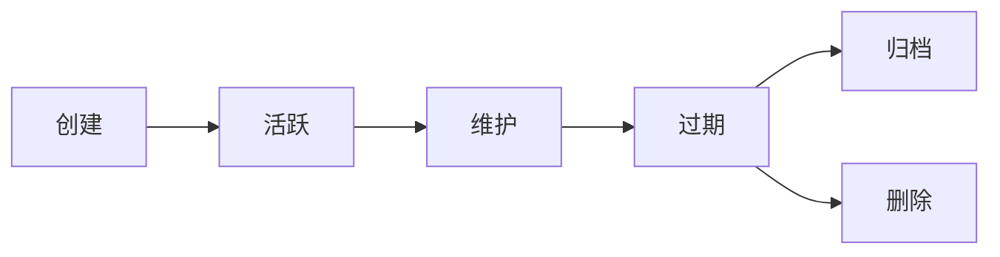

# 文档管理规范 / Documentation Management Standard

> **版本**: v1.0.0
> **最后更新**: 2025-10-26
> **适用范围**: 项目全部技术文档
> **维护者**: 技术委员会

---

## 📋 目录

1. [文档管理原则](#文档管理原则)
2. [文档命名规范](#文档命名规范)
3. [文档组织结构](#文档组织结构)
4. [文档分类体系](#文档分类体系)
5. [文档生命周期管理](#文档生命周期管理)
6. [文档质量标准](#文档质量标准)
7. [文档维护流程](#文档维护流程)
8. [文档审查与更新](#文档审查与更新)

---

## 🎯 文档管理原则

### 核心原则

| 原则 | 说明 | 优先级 |
|-----|------|--------|
| **扁平化管理** | 避免多层嵌套，采用单层目录结构 | 🔴 CRITICAL |
| **唯一性标识** | 每个文档具有唯一编号和清晰命名 | 🔴 CRITICAL |
| **可维护性** | 文档易于查找、更新和归档 | 🟡 IMPORTANT |
| **可追溯性** | 文档变更历史清晰可追溯 | 🟡 IMPORTANT |
| **一致性** | 命名和格式遵循统一标准 | 🟢 RECOMMENDED |

### 设计理念

```yaml
philosophy:
  structure: "扁平化 > 层级化"
  naming: "语义化 > 简洁化"
  maintenance: "自动化 > 手工化"
  accessibility: "易查找 > 完美分类"
```

---

## 📝 文档命名规范

### 命名格式

**标准格式**：
```
<编号>-<中文描述>__<English-Description>.md
```

**说明**：
- **编号**: 两位数字（01-99），用于排序和唯一标识
- **中文描述**: 简洁清晰的中文名称，体现文档主题
- **分隔符**: 使用双下划线 `__` 分隔中英文
- **英文描述**: 使用连字符连接的英文单词（Kebab-case）
- **扩展名**: 统一使用 `.md`

### 命名示例

✅ **正确示例**：
```
01-持续集成与部署__CICD-Configuration-Guide.md
02-服务层架构__Service-Layer-Architecture.md
03-服务层实现指南__Service-Layer-Implementation.md
10-已知问题__Known-Issues.md
```

❌ **错误示例**：
```
GitHub Actions CI-CD配置指南.md              # ❌ 缺少编号
1-Service层架构.md                           # ❌ 编号不是两位数
02-Service层架构-Service-Layer.md           # ❌ 使用单连字符分隔
02_服务层架构__Service-Layer.md             # ❌ 编号后使用下划线
```

### 编号分配规则

| 编号范围 | 用途 | 示例 |
|---------|------|------|
| 00-09 | 元文档（管理规范、索引等） | 00-文档管理规范 |
| 01-19 | 快速开始和基础指南 | 01-持续集成与部署, 08-快速开始指南 |
| 20-39 | 架构与设计文档 | 02-服务层架构, 09-技术架构评估 |
| 40-59 | 开发指南与实现细节 | 03-服务层实现指南, 04-服务层快速入门 |
| 60-79 | 测试与质量保证 | 06-测试总结报告 |
| 80-89 | 问题追踪与修复记录 | 10-已知问题, 11-错误修复总结 |
| 90-99 | 其他专项文档 | 12-TypeScript基础路径迁移 |

---

## 📂 文档组织结构

### 目录结构

```
project-root/
├── README.md                          # 项目主文档（必须保留在根目录）
├── CHANGELOG.md                       # 版本变更日志（根目录）
├── ARCHITECTURE.md                    # 技术架构文档（根目录）
├── PROJECT_OVERVIEW.md                # 项目概览（根目录）
├── DOCUMENTATION_INDEX.md             # 文档索引（根目录）
│
├── docs/                              # 主文档目录（扁平化管理）
│   ├── 00-文档管理规范__Documentation-Management-Standard.md
│   ├── 01-持续集成与部署__CICD-Configuration-Guide.md
│   ├── 02-服务层架构__Service-Layer-Architecture.md
│   ├── 03-服务层实现指南__Service-Layer-Implementation.md
│   ├── ...
│   │
│   └── archive/                       # 归档文档（按日期组织）
│       └── 2025-10-26/                # 归档日期目录
│           ├── CICD_REVIEW_AND_IMPROVEMENTS_2025-10-26.md
│           └── ...
│
└── tests/
    └── README.md                      # 测试目录说明（保留在原位置）
```

### 目录说明

| 目录/文件 | 用途 | 管理方式 |
|---------|------|---------|
| **根目录核心文档** | 项目入口文档，必须保留 | 禁止移动 |
| **docs/** | 所有技术文档集中管理 | 扁平化存储 |
| **docs/archive/** | 历史文档归档 | 按日期组织子目录 |
| **子目录README.md** | 子目录说明文档 | 保留在原位置 |

---

## 🗂️ 文档分类体系

### 按内容分类

| 分类 | 描述 | 编号范围 | 示例 |
|-----|------|---------|------|
| **元文档** | 文档管理规范、索引 | 00-09 | 文档管理规范 |
| **快速开始** | 新手入门、快速开始指南 | 01-19 | 快速开始指南 |
| **架构设计** | 系统架构、技术选型 | 20-39 | 服务层架构 |
| **开发指南** | 实现细节、开发规范 | 40-59 | 服务层实现指南 |
| **测试质量** | 测试策略、质量报告 | 60-79 | 测试总结报告 |
| **问题追踪** | 已知问题、修复记录 | 80-89 | 已知问题 |
| **专项文档** | 迁移指南、工具说明 | 90-99 | TypeScript迁移 |

### 按受众分类

| 受众 | 文档类型 | 关键特征 |
|-----|---------|---------|
| **新人开发者** | 快速开始、基础教程 | 循序渐进、实例丰富 |
| **资深开发者** | 架构设计、实现细节 | 深入原理、最佳实践 |
| **项目经理** | 路线图、评估报告 | 高层视角、指标量化 |
| **运维人员** | CI/CD配置、部署指南 | 操作步骤、故障排查 |
| **测试工程师** | 测试策略、质量报告 | 测试覆盖、缺陷分析 |

---

## ♻️ 文档生命周期管理

### 生命周期阶段



### 阶段定义

| 阶段 | 描述 | 存储位置 | 操作 |
|-----|------|---------|------|
| **创建** | 文档初次编写 | docs/ | 分配编号、命名 |
| **活跃** | 频繁更新和使用 | docs/ | 定期审查、更新 |
| **维护** | 偶尔更新 | docs/ | 季度审查 |
| **过期** | 不再更新但保留价值 | docs/ | 标记为归档候选 |
| **归档** | 历史参考价值 | docs/archive/YYYY-MM-DD/ | 移至归档目录 |
| **删除** | 无价值或重复 | N/A | 彻底删除 |

### 归档规则

**归档触发条件**：
- 文档已过期超过 **6个月**
- 文档内容已被新文档完全替代
- 临时性文档（如清理报告、迁移记录）任务完成后

**归档流程**：
```bash
# 创建归档目录
mkdir -p docs/archive/YYYY-MM-DD

# 移动过期文档
mv docs/<old-file>.md docs/archive/YYYY-MM-DD/

# 更新文档索引
# 在 DOCUMENTATION_INDEX.md 中标记为已归档
```

**归档目录命名**：
```
docs/archive/2025-10-26/    # 使用归档日期命名
```

---

## ✅ 文档质量标准

### 必备要素

每份文档必须包含以下元素：

```markdown
# 文档标题 / Document Title

> **版本**: v1.0.0
> **最后更新**: YYYY-MM-DD
> **维护者**: 姓名/团队
> **状态**: 活跃 | 维护 | 归档

---

## 📋 目录

[...]

## 📝 正文内容

[...]

## 📚 相关文档

- [相关文档1](./01-xxx.md)
- [相关文档2](./02-xxx.md)

## 📝 变更历史

| 版本 | 日期 | 变更内容 | 作者 |
|-----|------|---------|------|
| v1.0.0 | YYYY-MM-DD | 初始版本 | 姓名 |
```

### 质量检查清单

- [ ] **格式规范**: 遵循命名规范和模板
- [ ] **内容完整**: 包含必备要素（版本、日期、维护者）
- [ ] **语言准确**: 中文表达清晰，英文术语正确
- [ ] **链接有效**: 所有内部链接可访问
- [ ] **代码可运行**: 示例代码经过验证
- [ ] **图表清晰**: 图片和图表可读性强
- [ ] **版本一致**: 代码版本与文档版本匹配

---

## 🔄 文档维护流程

### 创建新文档

```bash
# 1. 确定文档编号（查看已有编号，避免冲突）
ls docs/ | grep -E '^[0-9]{2}-'

# 2. 创建文档（使用规范命名）
touch "docs/13-新文档主题__New-Document-Topic.md"

# 3. 填写文档模板
# 包含：标题、版本、目录、正文、相关文档、变更历史

# 4. 更新文档索引
# 在 DOCUMENTATION_INDEX.md 中添加新文档引用
```

### 更新现有文档

```bash
# 1. 修改文档内容
vim docs/01-xxx__xxx.md

# 2. 更新元信息
# - 版本号（遵循语义化版本）
# - 最后更新日期
# - 变更历史（添加新记录）

# 3. 验证链接和引用
# 确保所有内部链接有效

# 4. 提交变更（Git）
git add docs/01-xxx__xxx.md
git commit -m "docs: 更新文档01的XXX章节"
```

### 归档过期文档

```bash
# 1. 创建归档目录（使用当前日期）
mkdir -p "docs/archive/$(date +%Y-%m-%d)"

# 2. 移动文档
mv docs/old-document.md "docs/archive/$(date +%Y-%m-%d)/"

# 3. 更新文档索引
# 在 DOCUMENTATION_INDEX.md 中标记为已归档或删除引用

# 4. 提交变更
git add docs/
git commit -m "docs: 归档过期文档 old-document.md"
```

---

## 🔍 文档审查与更新

### 定期审查计划

| 文档类型 | 审查频率 | 负责人 |
|---------|---------|--------|
| 快速开始指南 | 每月 | 技术负责人 |
| 架构文档 | 每季度 | 架构师 |
| 开发指南 | 每季度 | 技术委员会 |
| 测试报告 | 每次发版后 | 测试负责人 |
| 问题追踪 | 实时更新 | 开发团队 |

### 审查检查清单

- [ ] 文档内容是否与当前代码版本一致？
- [ ] 是否有新的最佳实践需要补充？
- [ ] 链接是否全部有效？
- [ ] 示例代码是否可运行？
- [ ] 是否有过期或冗余内容需要删除？
- [ ] 文档结构是否清晰易懂？

### 更新触发条件

- **主动更新**: 定期审查计划
- **被动更新**:
  - 重大功能变更
  - 架构调整
  - 发现文档错误
  - 用户反馈

---

## 🛠️ 工具与自动化

### 推荐工具

| 工具 | 用途 | 命令 |
|-----|------|------|
| **markdownlint** | Markdown 格式检查 | `npx markdownlint docs/**/*.md` |
| **markdown-link-check** | 链接有效性检查 | `npx markdown-link-check docs/**/*.md` |
| **cspell** | 拼写检查 | `npx cspell "docs/**/*.md"` |

### 自动化脚本

**文档编号检查脚本** (`scripts/check-doc-numbering.sh`):
```bash
#!/bin/bash
# 检查文档编号是否重复

cd docs
ls -1 [0-9][0-9]-*.md | cut -d'-' -f1 | sort | uniq -d
if [ $? -eq 0 ]; then
  echo "❌ 发现重复编号！"
  exit 1
else
  echo "✅ 文档编号唯一"
fi
```

**链接检查脚本** (`scripts/check-doc-links.sh`):
```bash
#!/bin/bash
# 检查所有文档内部链接

npx markdown-link-check docs/**/*.md --config .markdown-link-check.json
```

---

## 📊 文档指标

### 质量指标

| 指标 | 目标值 | 测量方式 |
|-----|--------|---------|
| **文档覆盖率** | ≥ 90% | 核心功能文档化比例 |
| **链接有效率** | 100% | 自动化检查 |
| **更新及时性** | ≤ 1周 | 代码变更后文档更新时间 |
| **用户满意度** | ≥ 4.5/5 | 用户反馈评分 |

---

## 📝 变更历史

| 版本 | 日期 | 变更内容 | 作者 |
|-----|------|---------|------|
| v1.0.0 | 2025-10-26 | 初始版本，建立文档管理规范 | Claude Code |

---

## 📚 相关文档

- [DOCUMENTATION_INDEX.md](../DOCUMENTATION_INDEX.md) - 文档索引
- [README.md](../README.md) - 项目主文档
- [ARCHITECTURE.md](../ARCHITECTURE.md) - 技术架构文档

---

**维护者**: 技术委员会
**联系方式**: [GitHub Issues](https://github.com/your-repo/issues)
**最后审查**: 2025-10-26
