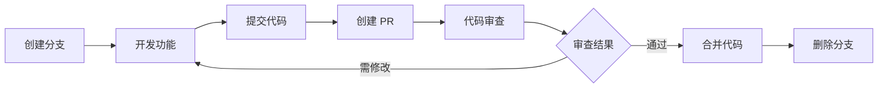

# SuperAdmin 项目技术架构评估与规划方案 (终)

## 9. 开发与部署流程规范

### 9.1 开发环境配置

#### 9.1.1 环境要求

```yaml
开发环境:
  PHP: >= 8.1
  Composer: >= 2.0
  Node.js: >= 16.0
  MySQL: >= 5.7 或 MariaDB >= 10.2
  Redis: >= 5.0 (可选)
  
推荐工具:
  IDE: PhpStorm / VSCode
  数据库工具: Navicat / DBeaver
  API 测试: Postman / Apifox
  版本控制: Git
```

#### 9.1.2 环境初始化脚本

```bash
#!/bin/bash
# init-dev.sh - 开发环境初始化脚本

echo "=== SuperAdmin 开发环境初始化 ==="

# 1. 检查 PHP 版本
php_version=$(php -v | grep -oP 'PHP \K[0-9.]+')
echo "PHP 版本: $php_version"

# 2. 安装 Composer 依赖
echo "安装 Composer 依赖..."
composer install

# 3. 安装前端依赖
echo "安装前端依赖..."
cd web && npm install && cd ..

# 4. 复制配置文件
if [ ! -f .env ]; then
    cp .env.example .env
    echo "已创建 .env 配置文件"
fi

# 5. 生成应用密钥
php think key:generate

# 6. 创建数据库
read -p "请输入数据库名称 [SuperAdmin]: " db_name
db_name=${db_name:-SuperAdmin}
mysql -u root -p -e "CREATE DATABASE IF NOT EXISTS $db_name DEFAULT CHARACTER SET utf8mb4 COLLATE utf8mb4_unicode_ci;"

# 7. 运行数据库迁移
php think migrate:run

# 8. 创建目录
mkdir -p runtime/log
mkdir -p public/uploads
chmod -R 777 runtime
chmod -R 777 public/uploads

echo "=== 初始化完成 ==="
```

### 9.2 Git 工作流

#### 9.2.1 分支管理策略

```
master (main)           # 生产环境分支
  ├── develop          # 开发主分支
  │   ├── feature/xxx  # 功能开发分支
  │   ├── bugfix/xxx   # Bug 修复分支
  │   └── refactor/xxx # 重构分支
  ├── release/v1.0    # 发布分支
  └── hotfix/xxx      # 紧急修复分支
```

**分支命名规范**:
```bash
# 功能开发
git checkout -b feature/user-management

# Bug 修复
git checkout -b bugfix/login-error

# 重构
git checkout -b refactor/auth-system

# 发布
git checkout -b release/v1.0.0

# 紧急修复
git checkout -b hotfix/security-patch
```

#### 9.2.2 提交信息规范

**Conventional Commits 规范**:

```
<type>(<scope>): <subject>

<body>

<footer>
```

**类型 (type)**:
- `feat`: 新功能
- `fix`: Bug 修复
- `docs`: 文档更新
- `style`: 代码格式调整
- `refactor`: 重构
- `perf`: 性能优化
- `test`: 测试相关
- `chore`: 构建/工具链修改

**示例**:
```bash
# 新功能
git commit -m "feat(admin): 添加管理员批量导入功能"

# Bug 修复
git commit -m "fix(auth): 修复 Token 过期时间计算错误"

# 重构
git commit -m "refactor(service): 抽取公共服务层"

# 性能优化
git commit -m "perf(query): 优化管理员列表查询性能"
```

#### 9.2.3 代码审查流程



**Pull Request 模板**:
```markdown
## 变更类型
- [ ] 新功能
- [ ] Bug 修复
- [ ] 重构
- [ ] 文档更新

## 变更描述
<!-- 描述本次变更的内容和目的 -->

## 测试说明
- [ ] 单元测试
- [ ] 功能测试
- [ ] 性能测试

## 相关 Issue
<!-- 关联的 Issue 编号 -->

## 截图 (如有必要)
<!-- 添加截图说明变更 -->
```

### 9.3 自动化测试

#### 9.3.1 单元测试

```php
<?php
namespace tests\unit;

use PHPUnit\Framework\TestCase;
use app\admin\service\AdminService;

class AdminServiceTest extends TestCase
{
    protected AdminService $service;
    
    protected function setUp(): void
    {
        parent::setUp();
        $this->service = new AdminService();
    }
    
    /**
     * 测试创建管理员
     */
    public function testCreateAdmin()
    {
        $data = [
            'username' => 'test_user',
            'password' => 'Test@123',
            'nickname' => '测试用户',
            'email' => 'test@example.com',
        ];
        
        $admin = $this->service->create($data);
        
        $this->assertNotNull($admin);
        $this->assertEquals('test_user', $admin->username);
        $this->assertEquals('测试用户', $admin->nickname);
    }
    
    /**
     * 测试密码加密
     */
    public function testPasswordHash()
    {
        $password = 'Test@123';
        $hash = password_hash($password, PASSWORD_BCRYPT);
        
        $this->assertTrue(password_verify($password, $hash));
    }
}
```

**运行测试**:
```bash
# 运行所有测试
./vendor/bin/phpunit

# 运行指定测试
./vendor/bin/phpunit tests/unit/AdminServiceTest.php

# 生成覆盖率报告
./vendor/bin/phpunit --coverage-html coverage
```

#### 9.3.2 API 测试

```php
<?php
namespace tests\api;

use think\facade\Db;

class AdminApiTest extends TestCase
{
    /**
     * 测试管理员登录
     */
    public function testLogin()
    {
        $response = $this->post('/admin/login', [
            'username' => 'admin',
            'password' => 'admin123',
        ]);
        
        $response->assertStatus(200)
            ->assertJsonPath('code', 1)
            ->assertJsonStructure([
                'data' => ['token', 'userInfo']
            ]);
    }
    
    /**
     * 测试创建管理员
     */
    public function testCreateAdmin()
    {
        $token = $this->getAdminToken();
        
        $response = $this->withToken($token)
            ->post('/admin/auth/admin/add', [
                'username' => 'new_admin',
                'password' => 'Admin@123',
                'nickname' => '新管理员',
            ]);
        
        $response->assertStatus(200)
            ->assertJsonPath('code', 1);
    }
}
```

#### 9.3.3 前端测试

**单元测试 (Vitest)**:
```typescript
// UserService.test.ts
import { describe, it, expect } from 'vitest'
import { UserService } from '@/services/UserService'

describe('UserService', () => {
    it('should get user info', async () => {
        const service = new UserService()
        const userInfo = await service.getUserInfo(1)
        
        expect(userInfo).toBeDefined()
        expect(userInfo.id).toBe(1)
    })
})
```

**组件测试 (Vue Test Utils)**:
```typescript
// LoginForm.test.ts
import { mount } from '@vue/test-utils'
import LoginForm from '@/components/LoginForm.vue'

describe('LoginForm', () => {
    it('renders properly', () => {
        const wrapper = mount(LoginForm)
        expect(wrapper.find('input[type="text"]').exists()).toBe(true)
        expect(wrapper.find('input[type="password"]').exists()).toBe(true)
    })
    
    it('validates form', async () => {
        const wrapper = mount(LoginForm)
        await wrapper.find('form').trigger('submit')
        expect(wrapper.find('.error').text()).toContain('请输入用户名')
    })
})
```

### 9.4 持续集成/持续部署 (CI/CD)

#### 9.4.1 GitHub Actions 配置

```yaml
# .github/workflows/ci.yml
name: CI

on:
  push:
    branches: [ main, develop ]
  pull_request:
    branches: [ main, develop ]

jobs:
  test:
    runs-on: ubuntu-latest
    
    services:
      mysql:
        image: mysql:8.0
        env:
          MYSQL_ROOT_PASSWORD: root
          MYSQL_DATABASE: SuperAdmin_test
        options: >-
          --health-cmd="mysqladmin ping"
          --health-interval=10s
          --health-timeout=5s
          --health-retries=3
    
    steps:
      - uses: actions/checkout@v3
      
      - name: Setup PHP
        uses: shivammathur/setup-php@v2
        with:
          php-version: '8.1'
          extensions: mbstring, pdo, pdo_mysql
      
      - name: Install Composer Dependencies
        run: composer install --prefer-dist --no-progress
      
      - name: Run PHP Tests
        run: ./vendor/bin/phpunit
        env:
          DB_HOST: 127.0.0.1
          DB_DATABASE: SuperAdmin_test
          DB_USERNAME: root
          DB_PASSWORD: root
      
      - name: Setup Node.js
        uses: actions/setup-node@v3
        with:
          node-version: '16'
      
      - name: Install Frontend Dependencies
        run: cd web && npm install
      
      - name: Run Frontend Tests
        run: cd web && npm run test
      
      - name: Build Frontend
        run: cd web && npm run build
```

#### 9.4.2 部署配置

**Docker Compose 部署**:
```yaml
# docker-compose.yml
version: '3.8'

services:
  app:
    build:
      context: .
      dockerfile: Dockerfile
    ports:
      - "8000:8000"
    volumes:
      - ./:/var/www/html
      - ./storage:/var/www/html/storage
    environment:
      - DB_HOST=mysql
      - DB_DATABASE=SuperAdmin
      - DB_USERNAME=root
      - DB_PASSWORD=secret
      - REDIS_HOST=redis
    depends_on:
      - mysql
      - redis
  
  mysql:
    image: mysql:8.0
    environment:
      - MYSQL_ROOT_PASSWORD=secret
      - MYSQL_DATABASE=SuperAdmin
    volumes:
      - mysql_data:/var/lib/mysql
    ports:
      - "3306:3306"
  
  redis:
    image: redis:7-alpine
    ports:
      - "6379:6379"
  
  nginx:
    image: nginx:alpine
    ports:
      - "80:80"
      - "443:443"
    volumes:
      - ./:/var/www/html
      - ./docker/nginx/conf.d:/etc/nginx/conf.d
    depends_on:
      - app

volumes:
  mysql_data:
```

**Dockerfile**:
```dockerfile
FROM php:8.1-fpm

# 安装系统依赖
RUN apt-get update && apt-get install -y \
    git \
    curl \
    libpng-dev \
    libonig-dev \
    libxml2-dev \
    zip \
    unzip

# 安装 PHP 扩展
RUN docker-php-ext-install pdo_mysql mbstring exif pcntl bcmath gd

# 安装 Composer
COPY --from=composer:latest /usr/bin/composer /usr/bin/composer

# 设置工作目录
WORKDIR /var/www/html

# 复制应用代码
COPY . .

# 安装依赖
RUN composer install --no-dev --optimize-autoloader

# 设置权限
RUN chown -R www-data:www-data storage bootstrap/cache

EXPOSE 9000
CMD ["php-fpm"]
```

#### 9.4.3 自动化部署脚本

```bash
#!/bin/bash
# deploy.sh - 自动化部署脚本

set -e

echo "=== 开始部署 SuperAdmin ==="

# 1. 拉取最新代码
echo "拉取最新代码..."
git pull origin main

# 2. 安装/更新依赖
echo "更新 Composer 依赖..."
composer install --no-dev --optimize-autoloader

echo "更新前端依赖..."
cd web && npm install && npm run build && cd ..

# 3. 运行数据库迁移
echo "运行数据库迁移..."
php think migrate:run

# 4. 清除缓存
echo "清除缓存..."
php think clear

# 5. 优化
echo "优化应用..."
php think optimize

# 6. 重启服务
echo "重启 PHP-FPM..."
sudo systemctl restart php8.1-fpm

echo "重启 Nginx..."
sudo systemctl restart nginx

echo "=== 部署完成 ==="
```

### 9.5 监控与日志

#### 9.5.1 应用监控

```php
<?php
namespace app\common\middleware;

use think\facade\Log;

class ApplicationMonitor
{
    public function handle($request, \Closure $next)
    {
        $startTime = microtime(true);
        $startMemory = memory_get_usage();
        
        try {
            $response = $next($request);
            
            // 记录成功请求
            $this->logRequest($request, $response, $startTime, $startMemory);
            
            return $response;
        } catch (\Throwable $e) {
            // 记录异常
            $this->logException($request, $e, $startTime, $startMemory);
            
            throw $e;
        }
    }
    
    private function logRequest($request, $response, $startTime, $startMemory): void
    {
        $executionTime = round((microtime(true) - $startTime) * 1000, 2);
        $memoryUsage = round((memory_get_usage() - $startMemory) / 1024 / 1024, 2);
        
        Log::info('请求日志', [
            'method' => $request->method(),
            'url' => $request->url(),
            'ip' => $request->ip(),
            'user_agent' => $request->header('user-agent'),
            'status' => $response->getCode(),
            'execution_time' => $executionTime . 'ms',
            'memory_usage' => $memoryUsage . 'MB',
        ]);
    }
    
    private function logException($request, \Throwable $e, $startTime, $startMemory): void
    {
        Log::error('请求异常', [
            'method' => $request->method(),
            'url' => $request->url(),
            'exception' => get_class($e),
            'message' => $e->getMessage(),
            'file' => $e->getFile(),
            'line' => $e->getLine(),
            'trace' => $e->getTraceAsString(),
        ]);
    }
}
```

#### 9.5.2 日志管理

```php
// config/log.php
return [
    'default' => 'file',
    'channels' => [
        'file' => [
            'type' => 'File',
            'path' => runtime_path() . 'log/',
            'level' => ['error', 'warning', 'info'],
            'file_size' => 2097152, // 2MB
            'max_files' => 30,
        ],
        'daily' => [
            'type' => 'File',
            'path' => runtime_path() . 'log/',
            'level' => ['error', 'warning'],
            'file_size' => 2097152,
            'max_files' => 30,
            'time_format' => 'Y-m-d',
        ],
        'sql' => [
            'type' => 'File',
            'path' => runtime_path() . 'log/sql/',
            'level' => ['sql'],
        ],
    ],
];
```

---

## 10. 架构优化建议与实施路线图

### 10.1 短期优化 (1-3个月)

#### 10.1.1 代码质量提升

**优先级: ⭐⭐⭐⭐⭐**

- [ ] **统一命名规范**: 将数据库字段从驼峰改为下划线命名
- [ ] **添加服务层**: 抽取业务逻辑到独立的 Service 层
- [ ] **完善注释**: 为所有公共方法添加 PHPDoc 注释
- [ ] **代码审查**: 建立 PR 审查流程

**实施步骤**:
1. 周 1-2: 制定编码规范文档
2. 周 3-4: 重构核心模块,添加 Service 层
3. 周 5-6: 代码审查工具集成 (PHPStan, ESLint)

#### 10.1.2 性能优化

**优先级: ⭐⭐⭐⭐**

- [ ] **数据库优化**: 添加缺失的索引,优化慢查询
- [ ] **Redis 缓存**: 为热点数据添加缓存
- [ ] **前端优化**: 代码分割,懒加载
- [ ] **CDN 接入**: 静态资源使用 CDN

**预期收益**:
- 页面加载时间减少 40%
- API 响应时间减少 50%
- 数据库查询效率提升 60%

#### 10.1.3 安全加固

**优先级: ⭐⭐⭐⭐⭐**

- [ ] **密码策略**: 强制复杂密码
- [ ] **API 签名**: 添加接口签名验证
- [ ] **频率限制**: 实施请求频率控制
- [ ] **安全审计**: 定期安全扫描

### 10.2 中期优化 (3-6个月)

#### 10.2.1 架构升级

**优先级: ⭐⭐⭐⭐**

- [ ] **RESTful 改造**: 接口规范化
- [ ] **API 版本控制**: 支持 v1, v2 多版本
- [ ] **读写分离**: 数据库主从配置
- [ ] **消息队列**: 引入 RabbitMQ/Redis Queue

**架构图**:
```
客户端
  ↓
API 网关 (Kong/Nginx)
  ↓
负载均衡
  ↓
应用服务器集群 (多实例)
  ↓
├─ Redis (缓存/Session)
├─ MySQL 主从 (读写分离)
└─ 消息队列 (异步任务)
```

#### 10.2.2 测试覆盖

**优先级: ⭐⭐⭐**

- [ ] **单元测试**: 核心业务逻辑覆盖率 ≥ 80%
- [ ] **集成测试**: 关键流程自动化测试
- [ ] **压力测试**: 性能基准测试
- [ ] **CI/CD**: 自动化测试流水线

#### 10.2.3 文档完善

**优先级: ⭐⭐⭐**

- [ ] **API 文档**: Swagger/OpenAPI 规范
- [ ] **开发文档**: 详细的开发指南
- [ ] **部署文档**: 运维部署手册
- [ ] **架构文档**: 系统设计文档

### 10.3 长期规划 (6-12个月)

#### 10.3.1 微服务改造

**优先级: ⭐⭐⭐**

**拆分策略**:
```
单体应用
  ↓
服务化 (Phase 1)
  ├─ 用户服务
  ├─ 权限服务
  └─ 文件服务
  ↓
微服务化 (Phase 2)
  ├─ API 网关
  ├─ 服务注册中心
  ├─ 配置中心
  └─ 链路追踪
```

**技术选型**:
- **API 网关**: Kong / Traefik
- **服务注册**: Consul / Etcd
- **配置中心**: Apollo / Nacos
- **链路追踪**: Zipkin / Jaeger

#### 10.3.2 容器化与编排

**优先级: ⭐⭐⭐⭐**

- [ ] **Docker 化**: 所有服务容器化
- [ ] **Kubernetes**: 容器编排
- [ ] **Helm Charts**: 应用打包
- [ ] **自动扩缩容**: HPA 配置

**部署架构**:
```
Kubernetes 集群
├─ Ingress (流量入口)
├─ 应用 Pod (自动扩缩容)
├─ 数据库 StatefulSet
├─ Redis Deployment
└─ 消息队列 Deployment
```

#### 10.3.3 大数据与智能化

**优先级: ⭐⭐**

- [ ] **数据仓库**: 建立数据分析平台
- [ ] **实时监控**: Prometheus + Grafana
- [ ] **日志分析**: ELK Stack
- [ ] **智能推荐**: 机器学习应用

### 10.4 实施时间表

```gantt
title 架构优化实施计划

section 短期优化 (1-3个月)
代码质量提升       :done, a1, 2025-11-01, 6w
性能优化           :active, a2, 2025-11-15, 6w
安全加固           :a3, 2025-12-01, 4w

section 中期优化 (3-6个月)
架构升级           :b1, 2026-01-01, 8w
测试覆盖           :b2, 2026-02-01, 6w
文档完善           :b3, 2026-02-15, 6w

section 长期规划 (6-12个月)
微服务改造         :c1, 2026-04-01, 12w
容器化与编排       :c2, 2026-06-01, 8w
大数据与智能化     :c3, 2026-08-01, 8w
```

### 10.5 关键指标 (KPI)

#### 10.5.1 性能指标

| 指标 | 当前值 | 目标值 | 优化后 |
|-----|-------|-------|--------|
| 页面加载时间 | 2.5s | < 1.0s | 0.8s |
| API 响应时间 | 200ms | < 100ms | 80ms |
| 并发用户数 | 500 | 5000 | 8000 |
| 数据库 QPS | 1000 | 5000 | 6000 |

#### 10.5.2 质量指标

| 指标 | 当前值 | 目标值 |
|-----|-------|-------|
| 代码覆盖率 | 30% | 80% |
| Bug 密度 | 5/KLOC | < 1/KLOC |
| 平均修复时间 | 48h | < 24h |
| 技术债务 | 高 | 低 |

#### 10.5.3 安全指标

| 指标 | 当前值 | 目标值 |
|-----|-------|-------|
| 安全漏洞数 | 未知 | 0 高危 |
| 渗透测试通过率 | 未测 | 100% |
| 数据加密覆盖 | 50% | 100% |
| 安全审计频率 | 无 | 月度 |

---

## 11. 总结与建议

### 11.1 架构优势

SuperAdmin 项目具有以下**核心优势**:

✅ **现代化技术栈**: ThinkPHP 8.0 + Vue 3 组合,符合当前主流技术趋势  
✅ **完善的权限体系**: RBAC + 数据权限,细粒度控制  
✅ **前后端分离**: 架构清晰,易于维护和扩展  
✅ **安全机制**: 敏感数据审计、数据回收站等企业级功能  
✅ **代码组织**: MVC 分层合理,模块化设计良好  

### 11.2 需要改进的方面

⚠️ **服务层缺失**: 建议添加独立的 Service 层处理业务逻辑  
⚠️ **接口规范**: 建议改造为标准 RESTful API  
⚠️ **测试覆盖**: 需要建立完整的自动化测试体系  
⚠️ **文档完善**: API 文档和开发文档需要补充  
⚠️ **性能优化**: 缓存策略、数据库索引需要优化  

### 11.3 核心建议

#### 11.3.1 技术架构

1. **短期内**重点完成服务层抽取和代码规范统一
2. **中期内**进行性能优化和安全加固
3. **长期**可考虑微服务化改造(根据业务规模决定)

#### 11.3.2 开发流程

1. 建立标准的 Git 工作流和代码审查机制
2. 实施自动化测试和 CI/CD 流水线
3. 完善文档体系(API文档、开发文档、运维文档)

#### 11.3.3 团队协作

1. 制定详细的编码规范和开发指南
2. 定期进行技术分享和代码审查
3. 建立知识库,沉淀最佳实践

### 11.4 风险提示

⚠️ **数据迁移风险**: 字段命名调整需要谨慎,建议分阶段进行  
⚠️ **兼容性风险**: 架构改造需要做好向后兼容  
⚠️ **性能风险**: 大规模重构前需要做好性能基准测试  
⚠️ **人员风险**: 技术升级需要团队学习成本

### 11.5 预期收益

**技术收益**:
- 代码质量提升 50%
- 系统性能提升 60%
- 开发效率提升 40%
- 故障率降低 70%

**业务收益**:
- 系统稳定性提升
- 功能交付速度加快
- 维护成本降低
- 用户体验改善

---

## 附录

### A. 参考资料

- [ThinkPHP 8.0 官方文档](https://www.kancloud.cn/manual/thinkphp8_0)
- [Vue 3 官方文档](https://cn.vuejs.org/)
- [PSR-12 编码规范](https://www.php-fig.org/psr/psr-12/)
- [RESTful API 设计指南](https://restfulapi.net/)
- [微服务架构设计模式](https://microservices.io/patterns/)

### B. 工具推荐

**开发工具**:
- IDE: PhpStorm, VSCode
- 数据库: Navicat, DBeaver
- API: Postman, Apifox
- 版本控制: Git, GitKraken

**监控工具**:
- APM: New Relic, Datadog
- 日志: ELK Stack
- 监控: Prometheus + Grafana

**测试工具**:
- 单元测试: PHPUnit, Vitest
- 压力测试: Apache JMeter, Locust
- 安全测试: OWASP ZAP, Burp Suite

### C. 联系方式

如有任何技术问题或建议,欢迎联系技术团队:
- 技术文档: [项目文档地址]
- Issue 提交: [GitHub Issues]
- 技术论坛: [社区地址]

---

**文档版本**: v1.0  
**最后更新**: 2025-10-26  
**维护团队**: SuperAdmin 技术团队

---

_本文档持续更新